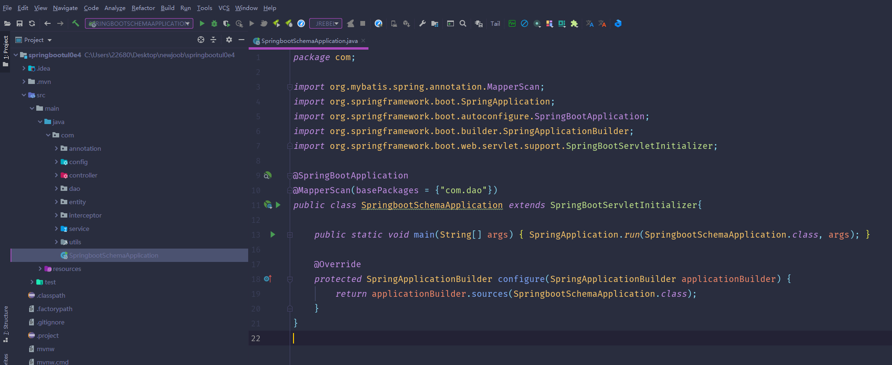
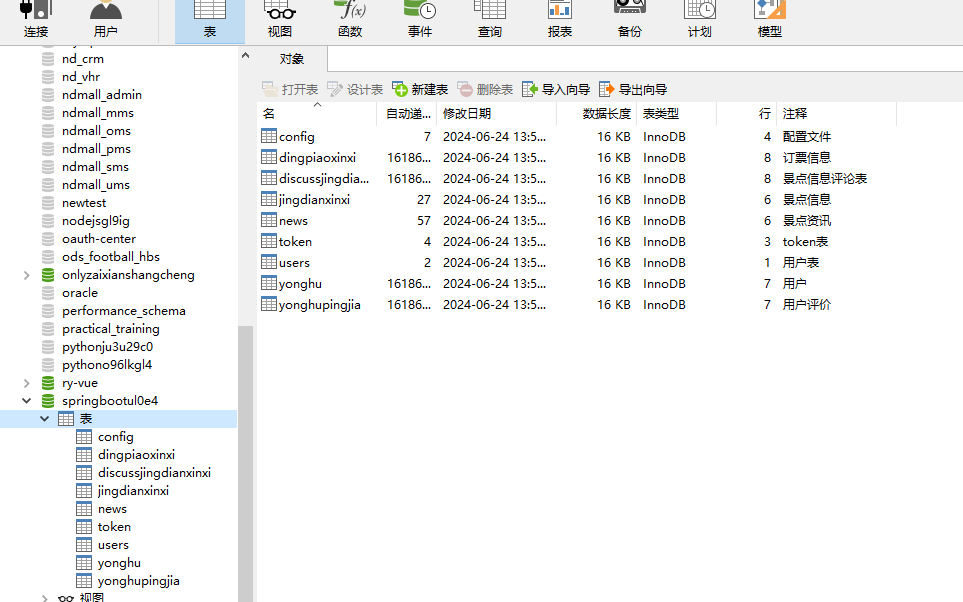
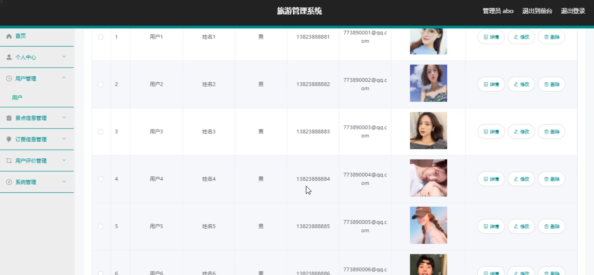
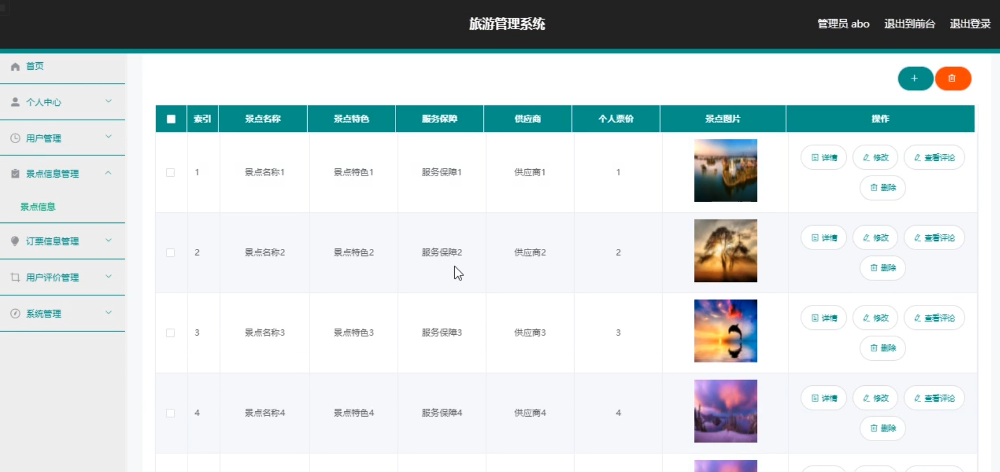
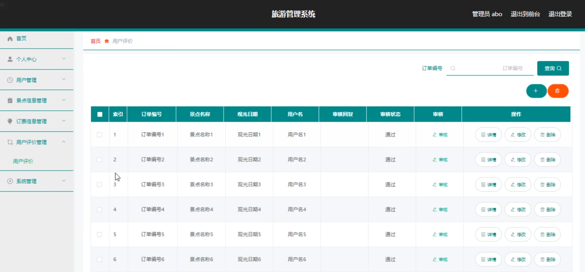
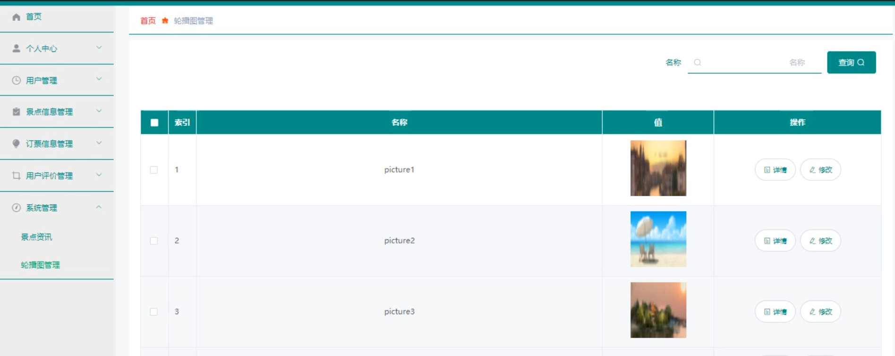
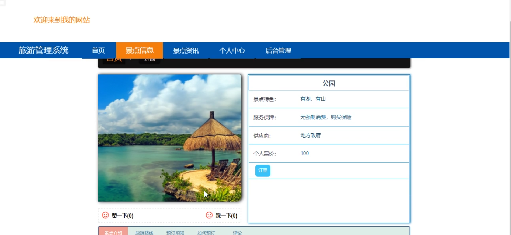
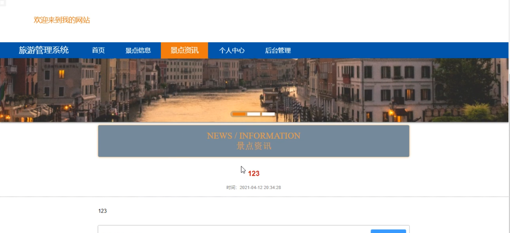
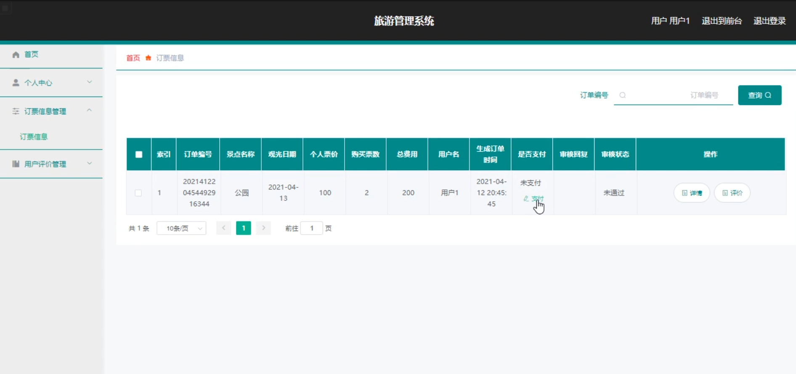
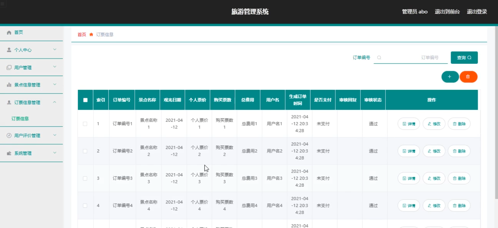

# 基于springboot的旅游管理系统

---
### 👉作者QQ ：1556708905 微信：zheng0123Long (支持定制修改、部署调试、定制毕设)

### 👉接网站建设、小程序、H5、APP、各种系统等

---

#### 介绍

本旅游管理系统是基于Spring Boot框架开发的一套全面、高效的旅游服务平台。该系统旨在通过信息化管理手段，提升旅游景点的管理效率，优化用户体验，并为旅游行业的数字化发展提供有力支持。系统支持管理员和用户两种角色，每种角色拥有不同的功能模块以满足其特定的需求。

#### 技术栈

后端技术栈：Springboot+Mysql+Maven

前端技术栈：Vue+Html+Css+Javascript+ElementUI

开发工具：Idea+Vscode+Navicate

#### 系统功能介绍

1. 管理员功能模块

个人中心：管理员可以在此模块中查看和修改自己的个人信息，包括用户名、密码、联系方式等，确保账号的安全性和个性化设置。  
用户管理：管理员可以管理系统中的用户账户，包括添加新用户、修改用户信息、删除用户等，实现用户信息的全面掌控。  
景点信息管理：管理员负责景点信息的录入、修改和删除，包括景点名称、地址、图片、介绍等，确保景点信息的准确性和完整性。  
订票信息管理：管理员可以查看和处理用户的订票记录，包括订票时间、用户信息、景点信息等，同时处理退票和改签请求，确保订票流程的顺畅。  
用户评价管理：管理员可以查看和管理用户对景点的评价信息，对评价进行审核和回复，以了解用户对景点的满意度和改进方向。  
系统管理：管理员可以对系统进行配置和管理，包括数据备份、日志查看、角色权限设置等，确保系统的稳定运行和安全性。  

2. 用户功能模块 

景点信息：用户可以浏览系统中的景点信息，包括景点名称、地址、图片、介绍等，并可以根据分类或关键词搜索景点。  
景点资讯：用户可以查看与景点相关的最新资讯和动态，了解景点的最新活动和优惠信息。  
个人中心：用户可以查看和修改自己的个人信息，包括用户名、密码、联系方式等，并查看自己的订票记录和评价信息。  
订票信息管理：用户可以浏览并选择景点进行订票，查看自己的订票记录和状态，同时可以进行退票和改签操作。  
用户评价管理：用户可以对景点进行评价和留言，分享自己的旅游体验和建议，帮助其他用户做出更好的选择。  

#### 系统作用

1. 提升管理效率：通过系统化管理，管理员可以更加便捷地管理景点信息、用户账户、订票记录等，减轻工作负担，提高管理效率。  
2. 优化用户体验：用户可以随时随地通过系统浏览景点信息、查看资讯、订票和评价，享受更加便捷、高效、个性化的旅游服务。  
3. 数据统计分析：系统可以对订票记录、用户评价等数据进行统计和分析，帮助管理员了解用户需求和市场趋势，为旅游行业的决策提供有力支持。  
4. 提升安全性：系统采用严格的权限管理和数据加密措施，确保用户数据的安全性和隐私保护。  

#### 系统功能截图

代码结构

数据库表

登录

用户管理

景点信息管理

用户评价管理

系统管理

前台页面景点信息

景点资讯

用户端后台管理

订票信息管理

#### 总结

本旅游管理系统是一套功能全面、性能稳定、安全可靠的旅游服务平台。通过信息化管理手段，该系统不仅提升了旅游景点的管理效率，还优化了用户体验，为旅游行业的数字化发展提供了有力支持。未来，我们将继续完善和优化系统功能，为旅游行业提供更加高效、便捷的服务。

#### 使用说明

创建数据库，执行数据库脚本 修改jdbc数据库连接参数 下载安装maven依赖jar 启动idea中的springboot项目

后台地址：http://localhost:8080/springbootul0e4/admin/dist/index.html

管理员  abo 密码 abo

前台地址：http://localhost:8080/springbootul0e4/front/index.html

